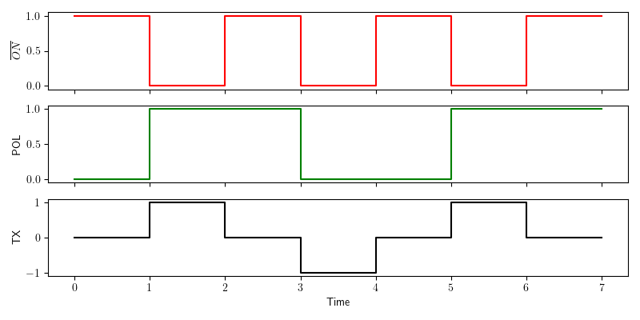
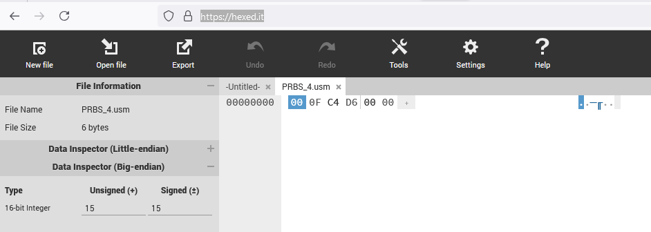
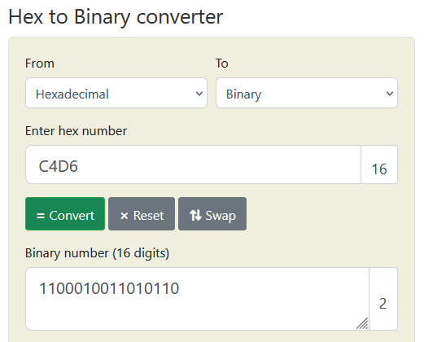

Generate User Defined Sequences 
===============================

In addition to the pre-programmed 50 % and 100 % duty-cycle control signals the XMT-R allows the user to generate their own user defined control signals. This allows the user to run the transmitter with user defined ternary signals. 

Control Signals 
+++++++++++++++

The transmitter signal of a ZONGE transmitter can have three states:

    #. Positive ON 
    #. OFF 
    #. Negative ON 

Positive ON and Negative ON refers to the fow of current flow through the transmitter antenna in opposite directions. To define the output signal of a transmitter the transmitter controller uses two binary control signals:

    #. :math:`\overline{ON}`
    #. POL

Each of the two control signals can be either in a LOW or a HIGH state. The high state is associated with a control signal voltage of 3.3 V while the low state is associated with a control signal voltage of 0 V.

The :math:`\overline{ON}` signal defines whether the transmitter is putting out a current or not. The bar over the :math:`\overline{ON}` indicates that this control signal is **active low**, meaning that the transmitter transmits a current when this signal is in a low state. To switch the transmitter signal off the :math:`\overline{ON}` signal must be set to a high state.

The POL signal controls the direction of the transmitter current flow. A high POL signal (POL = 3.3 V) is associated with a positive current flow while a low POL signal (POL = 0 V) is associated with a negative signal flow.

Output Signal Example 
+++++++++++++++++++++

    Generation of a 50% duty cycle output signal.

The above figure shows the generation of a 50% duty cycle transmitter signal as it is commonly used in time domain geophysical methods. The red graph on the top represents the :math:`\overline{ON}` control signal. The green graph in the middle shows the POL control signal and the black graph on the bottom represents the resulting transmitter output signal.

The example contains all three possible output states of the transmitter.

In the time interval from 0 to 1 the :math:`\overline{ON}` signal is HIGH. As the :math:`\overline{ON}` signal is an active low signal the transmitter is turned off during this period. In the time interval from 1 to 2 the :math:`\overline{ON}` signal is LOW and the transmitter is turned on. As the POL signal is HIGH during this time interval the transmitter output direction is positive. In the next time interval from 2 to 3 the :math:`\overline{ON}` signal is HIGH again and the transmitter is turned off. In the time interval from 3 to 4 the :math:`\overline{ON}` is LOW and the POL signal is high. This results in a negative output current direction of the transmitter signal. In the time interval from 4 to 7 the sequence of the time interval 0 to 4 is repeated.

.. note:: None of the signals contain amplitude information. The control signals are represented as binary LOW = 0 and HIGH = 1 signals. The resulting transmitter output curve only represents the direction of the current flow (-1 =negative and +1 = positive). The amplitude of the output signal is set to a predefined value on the transmitter. Please refer to the transmitter documentation for further details.

Generating the Signal Definition File
+++++++++++++++++++++++++++++++++++++ 

To use the transmitter with a user defined transmitter signal a signal definition file must be generated and uploaded to the XMT-R by the user. This file contains a sequence of control signal combinations. It uses the ending .usm for user mode. At every clock cycle of a base clock the XMT-R will read the next settings for the control signal pair from the .usm file. At the next clock cycle the output :math:`\overline{ON}` and POL signals are set according to the settings read in the previous clock cycle. In addition the next pair of settings is read. When the XMT-R reaches the last entry in the .usm file it automatically loops back to the beginning of the file. This results in a periodic output signal of the transmitter.

File Format 
-----------

To save storage space on the microcontroller the .usm files are stored in binary form. The file format is simple. It contains of three parts:

    #. Sequence length
    #. List of POL entries
    #. List of :math:`\overline{ON}` entries

The sequence length must be stored as 16 bit unsigned integer with big endian byte-order. This allows a maximum sequence length of :math:`2^{16} = 65,536` entries. 

The lists of POL and :math:`\overline{ON}` entries must be represented in binary form. Every eight consecutive bits are combined to a byte which is stored in the list. If the sequence length is not a multiple of 8 the last entry must be padded with zeros to generate a byte. The padding is only necessary to write the sequence as bytes. Based on the sequence length the XMT-R will ignore the padded bits.

The following Python code is an example for the generation of .usm file for an 4th order `Pseudo Random Binary Sequence (PRBS) <https://en.wikipedia.org/wiki/Pseudorandom_binary_sequence>`_. 

.. code-block:: python
    :linenos:

    import numpy as np
    np.set_printoptions(formatter={'int':hex})

    pol = [1,1,0,0,0,1,0,0,1,1,0,1,0,1,1]           # sequency for polarity
    on_ = [0,0,0,0,0,0,0,0,0,0,0,0,0,0,0]           # sequence for ~on  ~on is active low! 
    slen = len(pol)                                 # sequence lentgh

    # Pad the on and pol lists with 0 to have a lenght of a multiple of 8
    apol = 8-len(pol)%8
    for i in range(apol):
        pol.append(0)
        on_.append(0)

    pol_bytes = (np.packbits(np.array(pol),bitorder='big'))
    on_bytes  = (np.packbits(np.array(on_),bitorder='big'))
    print(pol_bytes)
    print(on_bytes)

    print('Sequence lenght = {}, {}'.format(slen,slen.to_bytes(2,byteorder='big')))
    print("Pol array = {}".format(pol))
    print("ON_ array = {}".format(on_))

    with open ("PRBS_4.usm", "wb") as binary_file:
        binary_file.write(slen.to_bytes(2,byteorder='big'))
        binary_file.write(pol_bytes)
        binary_file.write(on_bytes)

A PRBS only uses two states. In a geophysical transmitter these are current flow in the positive direction or current flow in the  negative direction. Consequently only the POL signal changes in the example. The :math:`\overline{ON}` signal is always 0 (always on). 

In the example the sequence of states of the two control signals are explicitly stated as Python lists in lines 4 and 5. Both lists must have the same number of entries. This number of entries is used to populate the sequence length variable slen in line 6. The length of a PRBS is :math:`2^N-1` where N is the PRBS order. In the case of a 4th order PRBS the sequence length is 15.

As 15 is not a multiple of 8 the lists need to be padded with one 0 each. This could be done by simply adding a 0 entry to both lists, but then the slen variable would be wrong. Instead of padding the lists manually lines 9 - 12 are used to pad the lists automatically.

After padding the lists both have 16 entries. These 16 entries are represented as 2 bytes of 8 bit each. To interpret the list entries as bits and convert them into bytes the lists are first converted to numpy arrays usind the command `numpy.array  <https://numpy.org/doc/stable/reference/generated/numpy.array.html>`_. Then the numpy arrays are converted to bytes using the command `numpy.packbits <https://numpy.org/doc/stable/reference/generated/numpy.packbits.html>`_. This is done in lines 14 and 15 of the example code.

Finally the binary file is written in lines 24 to 27. The slen variable is converted to a 2 byte number and written as first entry to the file. Then the two list entries for the POL and :math:`\overline{ON}` signals are written. The rest of the code are a couple of print lines for the user.

The generated file is 6 bytes long. The first 2 bytes define the 16 bit integer for the sequence length. The next two bytes contain the 15 bits of the POL list plus one bit for padding and the last two bytes contain the 15 bits of the ON list and one padding bit. The terminal output of the code is::

    [0xc4 0xd6]
    [0x0 0x0]
    Sequence lenght = 15, b'\x00\x0f'
    Pol array = [1, 1, 0, 0, 0, 1, 0, 0, 1, 1, 0, 1, 0, 1, 1, 0]
    ON_ array = [0, 0, 0, 0, 0, 0, 0, 0, 0, 0, 0, 0, 0, 0, 0, 0]

To better understand the generated file PRBS_4.usm file it was opened in an online `HEX editor <https://hexed.it/>`_.

    PRBS_4.usm file opened in hex editor.

On the left we srr that the file is 6 bytes long as expected. By changing the Visible Data Type in settings to 16 bit integer and moving the curser to the first entry we see on the left that the first number (first 2 bytes) is 00 0F in hexadecimal numbers or 15 in decimal numbers. This is the length of the sequence. The next two bytes C4 D6 can be entered into a `hexadecimal to binary converter <https://www.rapidtables.com/convert/number/hex-to-binary.html>`_. This results in:

    Conversion of bytes 3 and 4 to binary format.

Comparing the binary number with the POL array from the Python output shows that the numbers are the same. Keep in mind that only the first 15 entries are used as the last one is only padding.

The final two bytes in the PRBS_4.usm file are the binary entries of the :math:`\overline{ON}` signal states. As we keep :math:`\overline{ON}` LOW all the time these bytes are both 0.

Uploading a .usm File to the XMT-R 
++++++++++++++++++++++++++++++++++

To upload a .usm file the XMT-R must be connected via WiFi and the WEB interface to the smartphone, tablet or PC that contains the file. See section :doc:`web_interface` for details.

Transmitting a User Defined Sequence 
++++++++++++++++++++++++++++++++++++

The .usm file only defines the sequence of states the XMT-R will consecutively use to control the transmitter. It needs to be combined with a base frequency to generate the desired transmitter signal. The frequency can be selected on the WEB interface.

